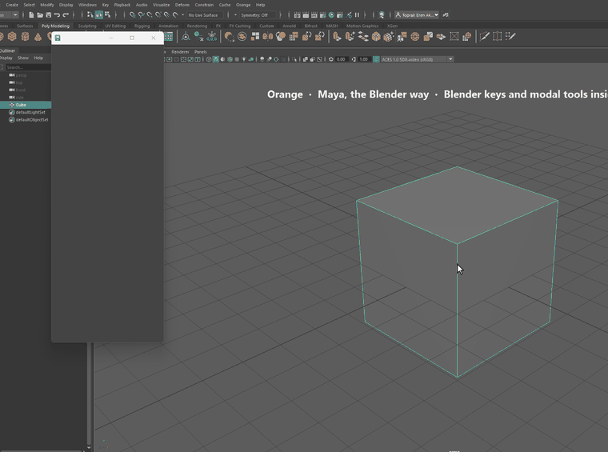

<p align="center"></p>

# Orange: Maya, the Blender way

Orange lets Blender users work in Autodesk Maya with the muscle memory they already have: the Blender keymap and mouse navigation, modal G / R / S with axis locking and typed values, Tab edit mode, extrude / inset / bevel / loop cut with live preview, pie menus, a 3D cursor, pivot and orientation pies, snapping, F2 / F3 / F9 and Blender-style preferences.

<p align="center"></p>
<p align="center"><sub>Keys shown on screen as they are pressed. <a href="docs/media/demo.mp4">MP4 version</a> (1080p).</sub></p>

It never edits Maya's own hotkeys. Turn it off from the **Orange** menu and Maya is back to its defaults. Keys are read by physical position, so it works on any keyboard layout. The interface is in English and Turkish.

> 🇹🇷 Türkçe açıklama [aşağıda](#türkçe).
>
> Orange is an independent project. It is not affiliated with or endorsed by the Blender Foundation or Autodesk. Blender is a trademark of the Blender Foundation; Maya is a trademark of Autodesk, Inc.

**Printable shortcut card:** [English](docs/cheatsheet_en.html) · [Türkçe](docs/cheatsheet_tr.html) (also in Maya: Orange menu → Shortcut card, with your own shortcuts).

---

## Install

1. Download the latest `Orange-<version>.zip` from the [Releases page](https://github.com/TeaYololo/orange-for-maya/releases) and unzip it.
2. Drag `drag_drop_install.py` onto a Maya viewport.

The installer:

- installs Orange as a Maya module in `Documents/maya/modules/orange` with an `orange.mod` file, so it starts with every Maya version that reads that folder,
- does **not** touch your own `userSetup.py` (the module brings its own),
- adds an **Orange** on / off button to the current shelf,
- removes copies left by version 0.6 and older (the `blender_kontrol` folder in your scripts folder and the auto-start block in `userSetup.py`),
- starts Orange right away.

**Without drag and drop** (Script Editor, Python tab):

```python
import sys; sys.path.insert(0, r"C:/path/to/unzipped/Orange-0.7.0")
import drag_drop_install; drag_drop_install.install()
```

**Uninstall:** Orange menu → **Remove Orange...** It deletes the module folder, the `.mod` file and the shelf button. Your settings and custom shortcuts stay, in case you come back.

**Studio / Autodesk App Store layout:** the release also ships `Orange-<version>-bundle.zip`. Unzip `Orange.bundle` into `%ProgramData%/Autodesk/ApplicationPlugins` (Windows) and Maya loads it for every user.

## Usage

- Shortcuts work while the mouse is **over a 3D viewport**; the Outliner, UV Editor and Graph Editor get their own Blender keys, every other editor keeps Maya's behaviour.
- **F1** shows the full shortcut list, **F3** searches every command, **Ctrl+,** opens the settings and the shortcut editor.
- **Orange** menu: on / off, shortcut list, settings, printable shortcut card, quick preferences, key test, report an issue, reload, remove.

### Highlights

| Area | What you get |
|---|---|
| Navigation and display | MMB orbit, Shift+MMB pan, Ctrl+MMB / wheel zoom, Alt+MMB center or align view, numpad views (Ctrl opposite, Shift local), Numpad 5 / 9 / 0 / . / Home, view pie, Z shading pie with Rendered, Shift+Alt+Z overlays, Ctrl+Alt+Q quad view, Shift+Space tool pie |
| Transform | Modal G / R / S, X / Y / Z (twice for global/local), Shift+axis planes, C clears, MMB auto axis, numeric input with Tab per axis and `=` expressions (`2m`, `90d`, `pi/2`), Ctrl snap, Shift precision, Alt+MMB navigation while transforming, colored axis line |
| Pivot / orientation / snap | `.` pivot pie (median, bounding box, 3D cursor, active, individual), `,` orientation pie (global, local, normal, view, cursor, parent), Shift+Tab snapping with increment / vertex / edge / face targets |
| Modeling | E / Alt+E extrude, I inset, Ctrl+B / Shift+Ctrl+B bevel, Ctrl+R loop cut with preview (several cuts slide together), G G / Shift+V slide (E even, F flip), Alt+S shrink/fatten, Shift+Alt+S to sphere, Shift+E crease, K knife, F / Alt+F fill, J connect, M merge, Alt+M split, P separate, V rip, Ctrl+M mirror, Ctrl+E / V / F menus, X / Ctrl+X delete, dissolve and limited dissolve, Grid Fill, U UV menu, Shift+A into the edited mesh |
| Selection | Tab, 1 / 2 / 3 (Shift multi, Ctrl expand), Alt+click loop (boundary aware, Shift toggles), Ctrl+Alt+click ring, Ctrl+click shortest path, Shift+Ctrl+click fill region, Ctrl+RMB lasso, B / W / C tools, Shift+G select similar / grouped, Shift+Ctrl+M select mirror, L / Ctrl+L linked |
| Object | Ctrl+P / Alt+P parent menus, Ctrl+L link materials / UVs / layer, Ctrl+G new layer, M move to layer, Ctrl+Alt+Shift+C set origin, Alt+Q transfer mode, Shift+O / Alt+O proportional falloff, Boolean from F3 |
| Animation | I / Alt+I keys, Space play, Shift+Ctrl+Space reverse, arrows and Alt+wheel for frames and keys |
| Modes and editors | Ctrl+Tab mode pie with Sculpt (F / Shift+F radius and strength, Blender brush keys) and Vertex / Weight / Texture Paint; UV editor keys (G / R / S with the mouse, 1-4, L, U, P, V, Alt+V, Shift+S); Graph Editor / Dope Sheet keys (G with the mouse, S, T, V, Shift+E, X, P); F9 adjust-last panel; red-white 3D cursor with rotation; Q favorites; Ctrl+F2 batch rename; Ctrl+PageUp/Down workspaces; Shift+` walk |
| Modifiers | Modifier panel (Orange menu): Subdivision Surface as smooth mesh preview, Mirror and Array as live instances, Bevel / Solidify / Triangulate / Weld as history nodes; toggle, adjust, apply; Ctrl+A applies them all |
| Working with Blender | Export FBX for Blender (meters, smoothing groups) and import FBX from Blender (Orange menu or F3); every Orange command is also in Maya's Hotkey Editor under "Orange" |
| Settings | Language, Emulate Numpad, Emulate 3 Button Mouse, spacebar action, Zoom to Mouse Position, Orbit Around Selection, defaults for pivot / orientation / snap, "no construction history in edit mode" (like Blender), preview drawing (Qt layer or Viewport 2.0), and a **shortcut editor** (press the new key, conflicts are resolved, saved to `prefs/blender_kontrol_keymap.json`) |

## Differences from Blender

- Every Maya operation leaves **construction history**. When you are done: **Ctrl+A → Delete History**, or turn on **"no construction history in edit mode"** in the settings (then F9 has nothing to adjust).
- **Modifiers** follow Maya's own model: in Maya every edit is appended after existing history, so a mirror or subdivision node would be edited "after" itself. Orange therefore uses smooth mesh preview for Subdivision and live instances for Mirror and Array (you keep editing the base mesh, like Blender's cage), and history nodes for Bevel, Solidify, Triangulate and Weld. Reordering the stack is not supported.
- Maya meshes cannot contain edges without faces, so there is **no vertex extrude**, and **F** on two vertices only adds an edge when they share a face.
- Maya is **Y-up** and uses centimeters by default; the numpad top view is Maya's top.
- The 3D cursor is a locator named `blenderCursor`, hidden in the Outliner and not selectable.
- Right click keeps Maya's marking menus.

## Compatibility

- Developed and tested on **Maya 2027 / Windows** (Python 3.13, PySide6 6.8).
- Maya 2022 – 2026 are supported in code (PySide2 for 2024 and older) but not tested on real machines yet.
- macOS (Carbon virtual key codes) and Linux / X11 (evdev + 8 scan codes) key tables are implemented and unit-tested with simulated key events, but not yet tested on real machines. Maya does not support Wayland; under XWayland the X11 table is used.

## Report a problem

In Maya: **Orange → Report an issue...** copies your Maya, Python, Qt, platform and settings details (nothing personal, nothing is sent anywhere) and opens the issue form; paste them there. If a key does nothing, **Orange → Key test...** shows how Orange reads that key; please include its line.

## Development

```
blender_kontrol/   the package (import name kept for compatibility); see the module map in __init__.py
icons/             shelf icon
tests/             test_pure.py (pytest, no Maya), headless_tests.py (mayapy), maya_live_tests.py (inside Maya)
tools/             build_release.py (zip + App Store bundle), build_cheatsheet.py, make_icons.py,
                   demo_capture.py + make_gif.py (README GIF, recorded inside Maya with real events)
docs/              cheat sheets, research notes, marketplace.md (App Store checklist), duyuru.md (announcement drafts)
```

- **Pure tests** (no Maya, CI): `python -m pytest tests` (needs `PySide6-Essentials`). They cover key tables, the keymap, translations, algorithms and the module layering rule.
- **mayapy tests:** `"C:/Program Files/Autodesk/Maya2027/bin/mayapy.exe" tests/headless_tests.py`
- **Live tests** run inside Maya and drive real key and mouse events (see the docstring of `tests/maya_live_tests.py`; they only create `bkt_` objects and restore camera, settings and shortcuts).
- **Lint:** `python -m ruff check blender_kontrol tests tools`
- **Release:** `python tools/build_release.py` → `dist/`

Version history: [CHANGELOG.md](CHANGELOG.md).

## Support

Orange is and will stay **free and open source** (Apache 2.0). There is no paid version and no feature is held back. If it saves you time, you can support its development with a donation: [Patreon](https://www.patreon.com/c/Yololo) or the **Sponsor** button on the repository page. Bug reports, key-test reports from macOS / Linux and pull requests help just as much.

## License

[Apache License 2.0](LICENSE). The keymap tables are written by hand from the Blender manual; no Blender source code is included.

---

<a name="türkçe"></a>
## Türkçe

**Orange**, Blender kullanıcılarının Maya'da alıştıkları kas hafızasıyla çalışmasını sağlar: Blender kısayolları ve fare navigasyonu, eksen kilitli ve sayı girişli modal G / R / S, Tab ile edit modu, önizlemeli extrude / inset / bevel / loop cut, kenar ve köşe kaydırma, pie menüler, 3D imleç, pivot ve oryantasyon pie'ları, snap, F2 / F3 / F9 ve Blender tarzı ayarlar.

Maya'nın kendi kısayollarına dokunmaz; **Orange** menüsünden kapatınca Maya varsayılanına döner. Tuşlar fiziksel konumdan okunur, Türkçe Q klavyede de Blender'daki yerlerinde çalışır. Arayüz Türkçe ve İngilizcedir; dil sistem diline göre seçilir, ayarlardan değiştirilebilir.

Orange bağımsız bir projedir; Blender Foundation ya da Autodesk ile ilişkili değildir. Blender, Blender Foundation'ın; Maya, Autodesk'in tescilli markasıdır.

**Kurulum:** [Releases sayfasından](https://github.com/TeaYololo/orange-for-maya/releases) `Orange-<sürüm>.zip` dosyasını indirip aç, `drag_drop_install.py` dosyasını Maya'nın 3D görünümüne sürükleyip bırak. Orange bir Maya modülü olarak `Belgeler/maya/modules/orange` klasörüne kurulur, Maya her açıldığında otomatik başlar ve rafa **Orange** aç/kapa düğmesi eklenir. Kendi `userSetup.py` dosyana dokunulmaz. 0.6 ve öncesinden kalan kopyalar (scripts klasöründeki `blender_kontrol` ve `userSetup.py`'deki blok) kendiliğinden temizlenir.

**Kaldırma:** Orange menüsü → **Orange'ı kaldır...** Modül klasörü, `.mod` dosyası ve raf düğmesi silinir; ayarların ve kısayolların kalır.

**Kullanım:** kısayollar fare 3D görünümün üzerindeyken çalışır. **F1** kısayol listesi, **F3** komut arama, **Ctrl+,** ayarlar ve kısayol düzenleyici. Kısayol düzenleyicide satıra çift tıklayıp yeni tuşa basman yeterli; çakışan komutun kısayolu kaldırılır. Orange menüsü → **Kısayol kartı** kendi kısayollarınla yazdırılabilir bir kart açar.

**Sorun bildirme:** Orange menüsü → **Sorun bildir...** Maya, Python, Qt, platform ve ayar bilgilerini panoya kopyalar (kişisel veri yok, hiçbir yere gönderilmez) ve GitHub sorun formunu açar. Bir tuş çalışmıyorsa Orange menüsü → **Tuş testi...** o tuşun nasıl okunduğunu gösterir; satırı rapora ekle.

**Modifier'lar ve Blender ile çalışma:** Orange menüsü → Modifier paneli: Subdivision (smooth preview), Mirror ve Array (canlı instance; taban mesh'i düzenlemeye devam edersin), Bevel / Solidify / Triangulate / Weld (geçmiş düğümü); Ctrl+A hepsini uygular. Orange menüsü ya da F3: Blender için FBX dışa aktar / Blender FBX içe aktar. Her Orange komutu Maya Hotkey Editor'da "Orange" kategorisinde.

**Blender'dan farklar:** Maya her işlemde geçmiş (history) bırakır, işin bitince Ctrl+A → Geçmişi temizle (ya da ayarlardan "edit modunda geçmiş bırakma"yı aç). Maya mesh'inde yüzü olmayan kenar olamadığı için köşe extrude yoktur ve F iki köşede yalnızca ortak yüzleri varsa kenar açar. Maya Y-yukarı ve santimetre kullanır. Sağ tık Maya'nın marking menu'sü olarak kalır.

**Uyumluluk:** Maya 2027 / Windows'ta geliştirildi ve test edildi. Maya 2022-2026 kodda destekleniyor ama gerçek makinede denenmedi. macOS ve Linux tuş tabloları var ve benzetimli tuş olaylarıyla test edildi, gerçek makinede henüz denenmedi.

**Destek:** Orange her zaman ücretsiz ve açık kaynak kalacak; ücretli bir sürümü ya da kilitli bir özelliği yok. İşine yarıyorsa [Patreon](https://www.patreon.com/c/Yololo) üzerinden ya da depo sayfasındaki **Sponsor** düğmesinden bağışla destek olabilirsin. Hata ve tuş testi raporları da en az bağış kadar değerli.

Lisans: [Apache License 2.0](LICENSE)
